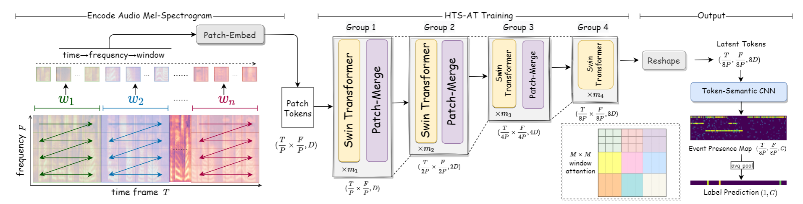
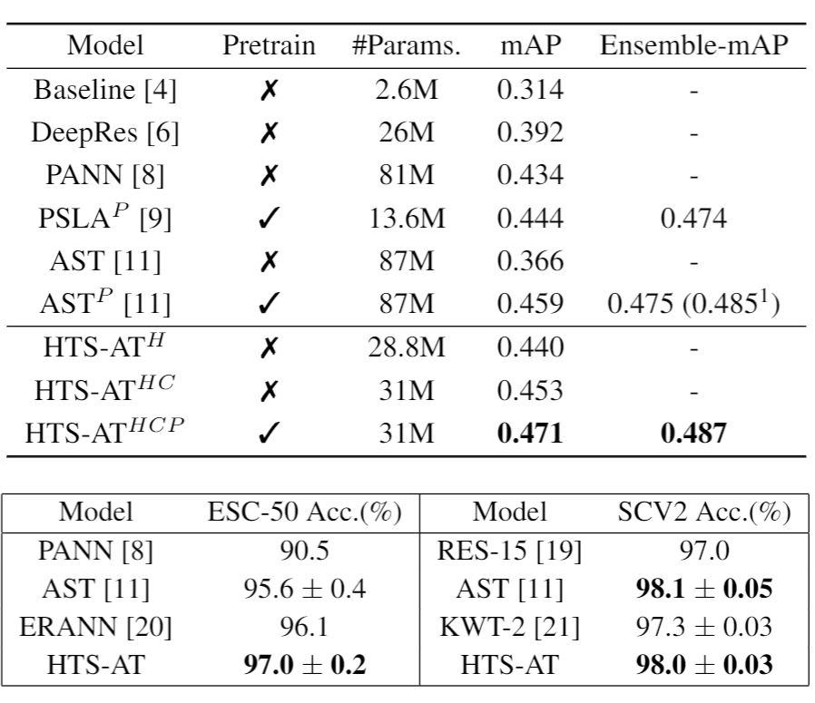
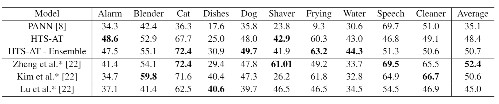

# Hierarchical Token Semantic Audio Transformer


## Introduction

The Code Repository for  "[HTS-AT: A Hierarchical Token-Semantic Audio Transformer for Sound Classification and Detection](https://arxiv.org/abs/2202.00874)", in ICASSP 2022.

In this paper, we devise a model, HTS-AT, by combining a [swin transformer](https://github.com/microsoft/Swin-Transformer) with a token-semantic module and adapt it in to **audio classification** and **sound event detection tasks**. HTS-AT is an efficient and light-weight audio transformer with a hierarchical structure and has only 30 million parameters. It achieves new state-of-the-art (SOTA) results on AudioSet and ESC-50, and equals the SOTA on Speech Command V2. It also achieves better performance in event localization than the previous CNN-based models. 



## Classification Results on AudioSet, ESC-50, and Speech Command V2 (mAP)

<p align="center">

</p>


## Localization/Detection Results on DESED dataset (F1-Score)




## Getting Started

### Install Requirments
```
pip install -r requirements.txt
```

### Download and Processing Datasets

* config.py
```
change the varible "dataset_path" to your audioset address
change the variable "desed_folder" to your DESED address
change the classes_num to 527
```

* [AudioSet](https://research.google.com/audioset/download.html)
```
./create_index.sh # 
// remember to change the pathes in the script
// more information about this script is in https://github.com/qiuqiangkong/audioset_tagging_cnn

python main.py save_idc 
// count the number of samples in each class and save the npy files
```
* [ESC-50](https://github.com/karolpiczak/ESC-50)
```
Open the jupyter notebook at esc-50/prep_esc50.ipynb and process it
```
* [Speech Command V2](https://arxiv.org/pdf/1804.03209.pdf)
```
Open the jupyter notebook at scv2/prep_scv2.ipynb and process it
```
* [DESED Dataset](https://project.inria.fr/desed/) 
```
python conver_desed.py 
// will produce the npy data files
```

### Set the Configuration File: config.py

The script *config.py* contains all configurations you need to assign to run your code. 
Please read the introduction comments in the file and change your settings.
For the most important part:
If you want to train/test your model on AudioSet, you need to set:
```
dataset_path = "your processed audioset folder"
dataset_type = "audioset"
balanced_data = True
loss_type = "clip_bce"
sample_rate = 32000
hop_size = 320 
classes_num = 527
```

If you want to train/test your model on ESC-50, you need to set:
```
dataset_path = "your processed ESC-50 folder"
dataset_type = "esc-50"
loss_type = "clip_ce"
sample_rate = 32000
hop_size = 320 
classes_num = 50
```

If you want to train/test your model on Speech Command V2, you need to set:
```
dataset_path = "your processed SCV2 folder"
dataset_type = "scv2"
loss_type = "clip_bce"
sample_rate = 16000
hop_size = 160
classes_num = 35
```

If you want to test your model on DESED, you need to set:
```
resume_checkpoint = "Your checkpoint on AudioSet"
heatmap_dir = "localization results output folder"
test_file = "output heatmap name"
fl_local = True
fl_dataset = "Your DESED npy file"
```

### Train and Evaluation

**Notice: Our model is run on DDP mode and requires at least two GPU cards. If you want to use a single GPU for training and evaluation, you need to mannually change *sed_model.py* and *main.py***

All scripts is run by main.py:
```
Train: CUDA_VISIBLE_DEVICES=1,2,3,4 python main.py train

Test: CUDA_VISIBLE_DEVICES=1,2,3,4 python main.py test

Ensemble Test: CUDA_VISIBLE_DEVICES=1,2,3,4 python main.py esm_test 
// See config.py for settings of ensemble testing

Weight Average: python main.py weight_average
// See config.py for settings of weight averaging
```

### Localization on DESED
```
CUDA_VISIBLE_DEVICES=1,2,3,4 python main.py test
// make sure that fl_local=True in config.py
python fl_evaluate.py
// organize and gather the localization results
fl_evaluate_f1.ipynb
// Follow the notebook to produce the results
```

### Model Checkpoints:

We provide the model checkpoints on three datasets (and additionally DESED dataset) in this [link](https://drive.google.com/drive/folders/1f5VYMk0uos_YnuBshgmaTVioXbs7Kmz6?usp=sharing). Feel free to download and test it.

## Citing
```
@inproceedings{htsat-ke2022,
  author = {Ke Chen and Xingjian Du and Bilei Zhu and Zejun Ma and Taylor Berg-Kirkpatrick and Shlomo Dubnov},
  title = {HTS-AT: A Hierarchical Token-Semantic Audio Transformer for Sound Classification and Detection},
  booktitle = {{ICASSP} 2022}
}
```
Our work is based on [Swin Transformer](https://github.com/microsoft/Swin-Transformer), which is a famous image classification transformer model.
